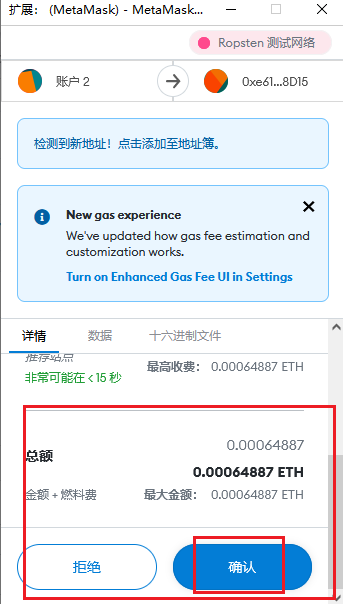
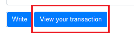
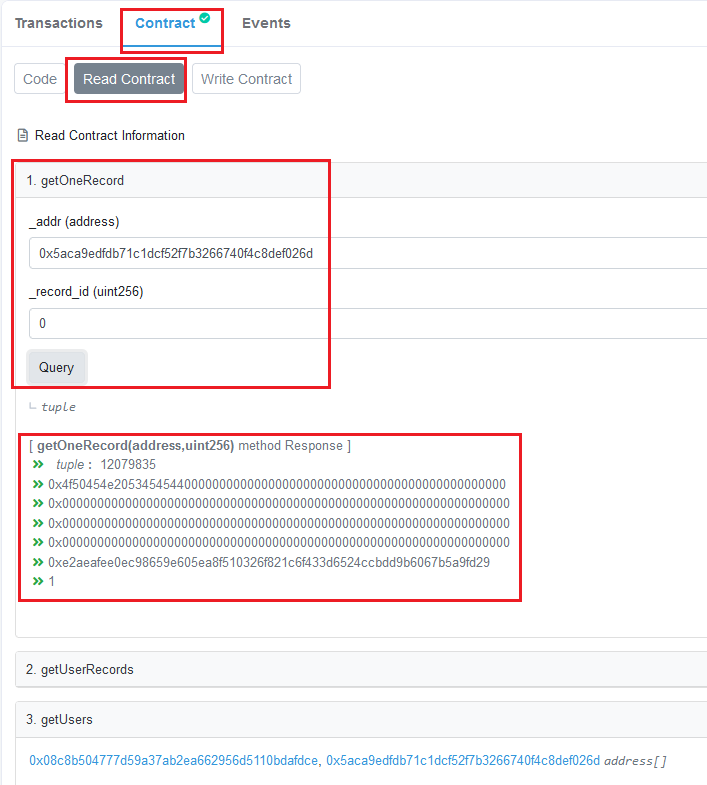

## 什么是OpenSeed？
[ZH](/README.md)  [EN](/README_en.md)

OpenSeed 是一个用于提供随机数/随机种子 (random seed) 的智能合约。
OpenSeed 将随机数使用记录到区块链上，证明你在实验中**真的使用了"随机数"**。

- 👨🏻‍💻 OpenSeed 部署在以太坊测试链上 ([Ethereum Ropsten testnet](https://ropsten.etherscan.io))
- 🔗 合约地址：[0xe618A5DCA9cda2f43696641D670936851Ac58D15](https://ropsten.etherscan.io/address/0xe618A5DCA9cda2f43696641D670936851Ac58D15)

## 为什么要使用OpenSeed ？
研究者常常在论文中声称:
- 我们进行了随机抽样
- 我们设置了随机的初始值
- ...

但是**如何证明研究者没有刻意选择一个随机值？**
有人会选择一个特殊值，例如生日或某个节点，来表示他们没有操纵实验的随机程序。但是这样的值有很多，所以不诚实的人可以多次尝试找到对他们有利的随机数。
因此，**每个实验应该和一个特定随机种子绑定**。

另一方面，不诚实的人可以通过修改数据集以使得实验结果对自己有利。
因此，**在随机种子被揭示后，数据集应当无法再修改**。

### **Solutions**
- 假定存在一个可信的第三方服务器，它可以源源不断的提供随机数。
- 研究者可以向服务器提交一个申请，表明随机数的用途，以随机对象（即数据集）的哈希值。然后服务器会向他返回一个随机数。
- 所有的申请记录都将公开，每个人都可以查询。

>✔️ 公开是使用记录可以避免研究者为同一个实验多次尝试不同的随机数。\
>✔️ 记录中的数据哈希值保证了随机数被揭示后，研究者无法修改数据集。\
>✔️ 当然研究者应当公开数据集和随机程序，并在论文中附上对应的申请记录，这样每个人都可以验证实验的真实性。

设置一个这样的服务器是困难的，但是通过智能合约，我们可以在区块链上运行这样的服务。\
区块链本质上是一个分布式账本，对于链外而言，区块哈希值是良好的随机数 [[On Bitcoin as a public randomness source](https://eprint.iacr.org/2015/1015)]。
OpenSeed 通过智能合约实现了去中心化的随机数生成服务，每个人都可以调用智能合约来获得随机数，并将随机数的使用记录在区块链上。
>⚠️<b>注意:</b> 如果合约本身需要用到随机数，你不应该选择链上的数据如``blockhash``, `block.timestamp` 作为随机源，因为矿工可以操纵这些数据。

## 如何使用OpenSeed ?
>👉 如果这是你第一次接触区块链，请先阅读 [如何使用智能合约](#如何使用智能合约)。

- ⚙️ 考虑到 Ethereum 主链交易费昂贵，我们将 OpenSeed 合约部署在了 [Ropsten](https://ropsten.etherscan.io) 测试链上。
- 🔗 合约地址：[0xe618A5DCA9cda2f43696641D670936851Ac58D15](https://ropsten.etherscan.io/address/0xe618A5DCA9cda2f43696641D670936851Ac58D15)
- OpenSeed 合约使用 struct ``Record`` 来记录每个随机数使用记录，主要包括以下字段
    - ``uint block_number`` 区块高度
    - ``bytes32 desc`` 使用随机数的目的
    - ``bytes32 data_sha256``  数据的SHA256
    - ``bytes32 data_ipfs``  数据的 URL 或 IPFS 
    - ``bytes32 access``  文章出版后的 doi 或 标题
    - ``bytes32 seed`` 随机数，即下一个区块的哈希值
    - ``State state`` 记录的当前状态

**1. 创建一个申请**

首先，我们需要调用 function ``create(desc, data_sha256, data_ipfs)`` 来创建一条随机数记录 (record)。

>🔔 由于链上存储是昂贵的, OpenSeed 合约使用 ``bytes32`` 来存储大部分数据, 因此数据的大小被限制为 32 bytes (或 64 chars)。
如果你的数据（例如 desc）长度超过了 32 bytes，你可以提交数据的 SHA-256 ，并在其他地方提供完整数据的下载。\
📌 我们提供了一段Python代码 [bytes32Utils.py](/openseed/bytes32Utils.py) 来转换 *string* 和 *bytes32*.

*create* 合约交易被确认后，查看日志 ``_stateChange(address, record_id, state)`` 来获得记录的 id ``record_id``. 接下来我们需要使用日志 id ``record_id`` 来查询或更新 record 状态。


**Step 2: 获得随机数**

OpenSeed 使用下一个区块哈希值作为随机数，因此提交 *create* 交易后，需要等待一个区块（约13秒）。

然后，我们调用 function ``update(record_id)`` 来刷新 record 中的随机数。``update`` 需要提交对应的 ``record_id``。
我们可以查看日志 ``_openSeed(address, record_id, random seed)`` 来获得随机数 (random seed)。


>⚠️<b>注意:</b> 由于EVM中只存储最近256个区块的信息，因此，在 ``create`` 确认后，我们需要尽快调用 ``update`` 方法刷新 record 中的随机数。记得把交易费调高，以尽快确认 *update* 交易！


```python
#将获取的区块哈希值（随机数）作为随机种子
import random
random.seed(0x4abda1a3f87fd9938ac35470a03d19894764b7c47c62d48f8fb32ffbf00ea47b)
print(random.random())
```

>📦 调用了 update 以后，你可以随时调用 function ``updateIPFS(record_id, data_ipfs)`` 来更新数据的资源地址。

**Step 3: 锁定**

论文发表后，我们可以调用 function ``lock(record_id, access)`` 来将我们的论文 doi 或*文章的在线资源*与链上的随机数记录绑定起来。

>📄 我们应该在文章中提供 OpenSeed 的``合约地址(contract address)``，``钱包地址(wallet address)``，`记录id (record_id)`以及数据资源等信息，这样每个人都可以验证实验的真实性。

>🔔 研究者应一直使用同一个钱包地址来获得随机数，这样每个人都可以方便的查询到所有的记录\
>🔔 一篇文章如果要用多个随机数，不要申请多条记录，应该将获得随机数作为随机种子来生成多个随机数。

**Step 4: 查询**

OpenSeed 提供了一些查询方法:
- ``getOneRecord(wallet address, record_id)`` 查询一条随机数记录
- ``getUserRecords(wallet address)`` 查询一个用户的所有随机数记录
- ``getUsers`` 查询所有使用 OpenSeed 用户的 address


## 引用
```
@article{open_seed, title={OpenSeed}, url={https://github.com/d0scoo1/OpenSeed}, author={Kailun Yan}}
```

## 如何使用智能合约

这里我们介绍如何从零开始调用一个智能合约。

>⚠️<b>注意:</b> 我们所有的步骤都是在 [Ropsten 测试链](https://ropsten.etherscan.io) 上运行的。

### 1. 配置以太坊钱包

首先准备一个以太坊钱包，这里介绍如何使用 [Metamask](https://metamask.io/) 插件生成一个钱包。

1. 首先访问 https://metamask.io/ 安装浏览器插件


2. 如果你没有钱包，选择创建钱包


3. 打开测试网络选项


4. 切换网络为 Ropsten 测试网络，点击账户可以**复制账户地址**


### 2. 获得一些 Ether
现在你的钱包是空的，你可以通过 Ropsten testnet faucet 免费获得一些以太币。\
下面是一些 Ropsten testnet faucet
- https://ropsten.oregonctf.org/
- https://faucet.egorfine.com/
- https://faucet.metamask.io/

打开上述网站，输入刚刚复制的账户地址，获得一些Ether。

### 3. 查看区块链信息

[Etherscan](https://etherscan.io/)是一个区块链浏览器，它提供了丰富的区块链信息。由于 OpenSeed 还没有提供 web3 服务，因此我们使用 [Ropsten Etherscan](https://ropsten.etherscan.io/) 来运行智能合约。

1. 首先打开 OpenSeed 合约 https://ropsten.etherscan.io/address/0xe618a5dca9cda2f43696641d670936851ac58d15 \
查看地址的交易 (Transaction), 合约 (Contract), 日志 (Events)


2. 依次点击 Contract, Write Contract, Connect to Web3, 选择 MetaMask 连接到你的以太坊账户


3. 连接成功后会显示 **Connected -Web3**\
然后我们点击展开 ``create`` 方法，输入三个参数，点击 Write 提交。\
提交后会跳出 MetaMask 插件，这里我们需要修改一下交易费。


>👉 ``create`` 方法输入的参数是 ``bytes32`` 格式。如 0x4d61792074686520466f726365206265207769746820796f752e000000000000 这样一段数据。\
📌 我们提供了一段Python代码 [bytes32Utils.py](/openseed/bytes32Utils.py), 你可以用它来转换 *string* 和 *bytes32*。\
👨‍💻 你可以使用程序或 [在线网站](https://crypot.51strive.com/sha256.html) 获得数据的 SHA-256, 记得在结果前补齐 0x...

4. 由于是在测试链上，为了交易尽快被打包到区块，我们最好设置交易费为高\
然后确认发送交易




5. 发送成功后， view 旁边会显示 View your transaction\
点击查看我们的交易。



6. 等待交易成功后，\
你可以点击 From 的地址查看自己账户的交易记录，\
也可以点击 Contract 地址查看合约的交易记录，\
这里我们点击 Logs 查看日志


7. 日志显示了 ``create`` 中 event 发出的信息\
你还可以通过 State 等查看合约的运行结果


8. 🎉 恭喜，你已经成功运行了一个智能合约交易！

9. 接下来，你可以尝试调用 Read Contract 来查看你刚才提交的 record。\
``getOneRecord`` 中返回的结果请参阅 [如何使用OpenSeed](如何使用OpenSeed) 中对于 struct record 的介绍



### IPFS
⭐️ IPFS 是一个分布式存储，这是一个免费的 1GB IPFS存储 -  https://www.pinata.cloud/


## License
MIT: https://github.com/d0scoo1/OpenSeed/blob/main/LICENSE


